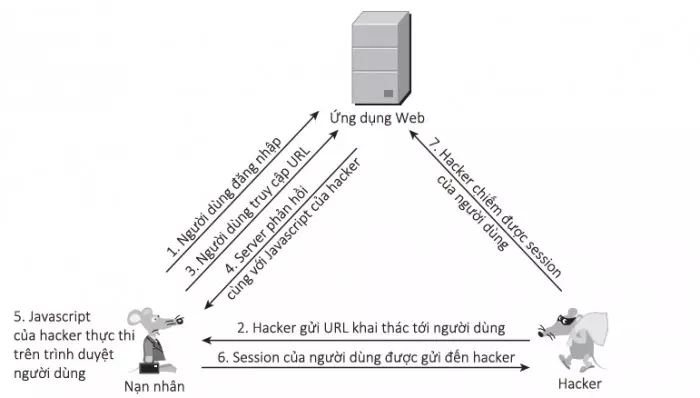

#### 2.2.1. Khái niệm
Reflected XSS khác với lại Stored XSS, lỗ hổng này thường tấn công 1 cá nhân nào đó. Với dạng tấn công này thì hacker chèn mã độc vào URL dưới dạng query String.

Tầm ảnh hưởng của Reflected XSS không rộng bằng Stored XSS nhưng mức độ nguy hiểm là tương đương. Hacker thường gửi link có mã độc qua email, tin nhắn, ... và dụ dỗ người dùng click vào.

#### 2.2.2. Cách triển khai




#### 2.2.3. Ví dụ

Trang web với mục đích là tìm kiếm và nhận yêu cầu tìm kiếm với URL parameter là `term=gift`
```
https://reflected-xss.com/search?term=gift
```

<br>
Trang web sau khi thực hiện xong yêu cầu sẽ trả về như dưới đây:

```html
<p>You searched for: gift</p>
```

Hacker muốn tấn công sẽ tấn công như thế này:
```
https://insecure-website.com/search?term=<script>/*+Bad+stuff+here...+*/</script>
```

<br>
Kết quả trả về như bên dưới:

```html
<p>You searched for: <script>/* Bad stuff here... */</script></p>
```

