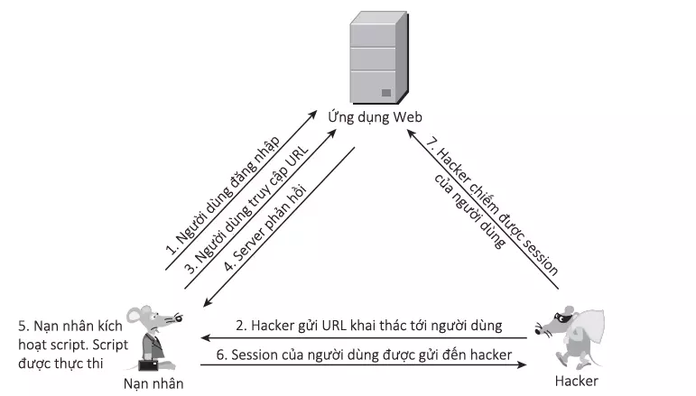
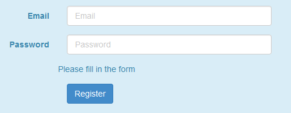
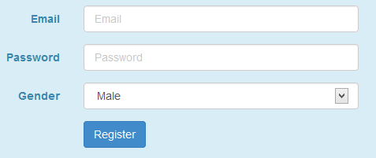
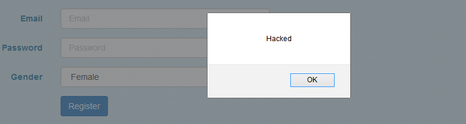

#### 2.3.1. Khái niệm
DOM Based XSS là kỹ thuật khai thác XSS dựa trên việc thay đổi cấu trúc DOM của tài liệu, cụ thể là HTML.

#### 2.3.2. Cách khai thác



#### 2.3.3. Ví dụ
Một website có URL đến trang đăng ký như sau:

```
http://example.com/register.php?message=Please fill in the form
```

Khi truy cập đến thì chúng ta thấy một Form rất bình thường



Có thể dễ dàng suy luận tham số message truyền vào nội dung thông báo trên form, xem kỹ source code của đoạn thông báo này

```html
<div>
    <script>
        var pos = document.URL.indexOf("message=") + 8;
        var userInput = document.URL.substring(pos, document.URL.length);
        document.write(unescape(userInput));
    </script>
</div>
```

Đoạn JavaScript có nhiệm vụ lấy giá trị từ tham số message và in ra. Từ việc kiểm tra đầu vào lỏng lẻo này, hoàn toàn có thể lừa người dùng truy cập các URL nguy hiểm.
Thay vì truyền
```
message=Please fill in the form
```

thì truyền

```js
message=<label>Gender</label><div class="col-sm-4"><select class = "form-control" onchange="java_script_:show()"><option value="Male">Male</option><option value="Female">Female</option></select></div><script>function show(){alert();}</script>
```

Khi đấy Form đăng ký sẽ trở thành thế này:


Người dùng sẽ chẳng chút nghi ngờ với một form “bình thường” như thế này, và khi lựa chọn giới tính, Script sẽ được thực thi



Mục đích chính của nó là thực thi hàm show() mỗi khi có sự kiện onchage trên thẻ select, hàm show() ở đây chỉ đơn thuần bật ra popup để chứng tỏ script đã được thực thi. Tuy nhiên trong thực tế, hacker thường sẽ sử dụng hàm show() này để truyền giá trị cookie người dùng về một server định trước